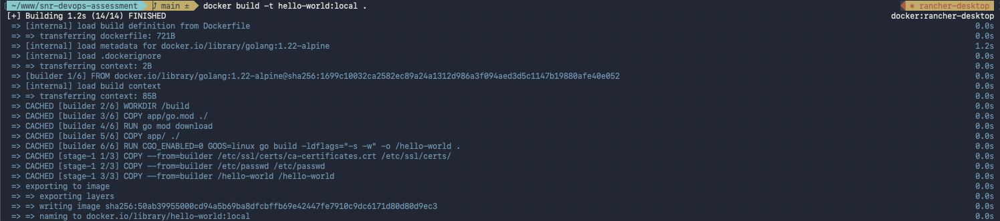
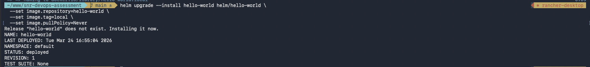
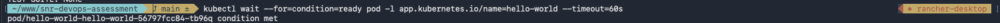
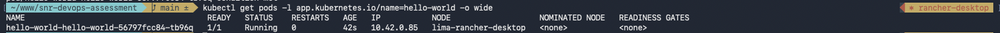
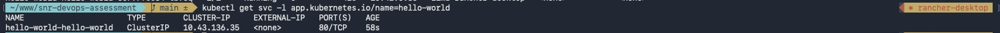
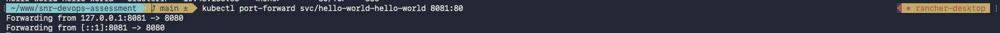
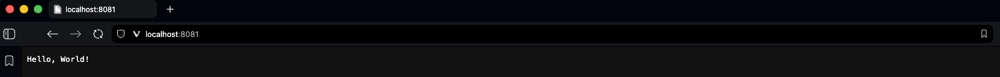
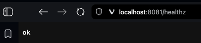

# Hello World — DevOps Assessment

Containerised Go hello-world app with a CI pipeline and Helm chart for Kubernetes deployment.

## Repository Structure

```
.
├── Dockerfile                        # Multi-stage production build
├── .github/workflows/ci.yml          # GitHub Actions pipeline
├── app/
│   ├── main.go                       # Go web server (provided)
│   └── go.mod
├── helm/
│   ├── hello-world/                  # Application chart
│   │   ├── Chart.yaml
│   │   ├── values.yaml
│   │   └── templates/
│   │       ├── deployment.yaml
│   │       └── service.yaml
│   └── lib-common/                   # Library chart (provided, bug fixed)
│       ├── Chart.yaml
│       └── templates/
│           ├── _helpers.tpl
│           ├── _deployment.tpl
│           └── _service.tpl
├── screenshots/                      # Local deployment proof
│   ├── screenshot-1-docker-build.png
│   ├── screenshot-2-helm-install.png
│   ├── screenshot-3-kubectl-wait.png
│   ├── screenshot-4-get-pods.png
│   ├── screenshot-5-get-svc.png
│   ├── screenshot-6-port-forward.png
│   ├── screenshot-7-hello-world.png
│   └── screenshot-8-healthz.png
└── README.md
```

---

## Dockerfile

I went with a two-stage build using `golang:1.22-alpine` to compile and `scratch` as the final image.

**Why scratch?** The Go binary is statically compiled (`CGO_ENABLED=0`), so it doesn't need libc or any OS packages. Scratch gives the smallest possible image — just the binary, CA certificates, and a passwd file for the non-root user. Final image is around 7MB.

Other things worth noting:
- `go.mod` is copied before the source code so dependency downloads are cached in their own layer — code changes don't re-download deps
- `-ldflags="-s -w"` strips debug symbols to reduce binary size
- Runs as `nobody` — no root access in the container
- CA certs are included so the app could make outbound HTTPS calls if needed

---

## CI Pipeline

The GitHub Actions workflow (`.github/workflows/ci.yml`) has three jobs:

1. **Lint Helm Chart** — builds the lib-common dependency, lints the chart, and renders templates to check for errors
2. **Lint Dockerfile** — runs hadolint to catch Dockerfile anti-patterns
3. **Build Docker Image** — only runs after both lints pass. Uses Buildx with GHA caching and tags the image with the commit SHA

The two lint jobs run in parallel, and the build job has `needs: [lint-helm, lint-dockerfile]` so it waits for both to pass before starting.

---

## Helm Chart

The `hello-world` chart uses `lib-common` as a local dependency (`file://../lib-common`). The templates are thin wrappers that call the library's `define` blocks for the Deployment and Service.

Default values include:
- **Resources**: 50m/32Mi request, 200m/64Mi limit — conservative but reasonable for a hello-world Go binary
- **Health probes**: Both liveness and readiness hit `/healthz` which the app already exposes
- **Service**: ClusterIP on port 80, forwarding to the container's port 8080

---

## Library Chart Bug Fix

Found an indentation bug in `helm/lib-common/templates/_deployment.tpl`.

The `ports` field was indented at 8 spaces, placing it as a sibling of the container list item instead of inside the container spec:

```yaml
# Before (broken) — ports sits outside the container
        - name: {{ .Chart.Name }}
          image: "..."
          imagePullPolicy: IfNotPresent
        ports:                              # ← wrong: 8 spaces
            - name: http

# After (fixed) — ports is correctly nested inside the container
        - name: {{ .Chart.Name }}
          image: "..."
          imagePullPolicy: IfNotPresent
          ports:                            # ← correct: 10 spaces
            - name: http
```

This would cause the Deployment to be rejected by Kubernetes because `ports` wouldn't be a valid field at that level in the pod spec. The fix was straightforward — added two spaces to align `ports` with the other container-level fields like `imagePullPolicy`.

---

## Local Deployment (Bonus)

Deployed to a local Kubernetes cluster running via Rancher Desktop (k3s).

**Steps:**

```bash
# Build the image locally (~4.8MB final size)
docker build -t hello-world:local .

# Install the chart with the local image
helm upgrade --install hello-world helm/hello-world \
  --set image.repository=hello-world \
  --set image.tag=local \
  --set image.pullPolicy=Never

# Port-forward to localhost:8081
kubectl port-forward svc/hello-world-hello-world 8081:80
```

**Pod and Service status:**

```
$ kubectl get pods -l app.kubernetes.io/name=hello-world -o wide
NAME                                       READY   STATUS    RESTARTS   AGE   IP           NODE                   NOMINATED NODE   READINESS GATES
hello-world-hello-world-56797fcc84-45wgw   1/1     Running   0          5m    10.42.0.83   lima-rancher-desktop   <none>           <none>

$ kubectl get svc -l app.kubernetes.io/name=hello-world
NAME                      TYPE        CLUSTER-IP      EXTERNAL-IP   PORT(S)   AGE
hello-world-hello-world   ClusterIP   10.43.112.197   <none>        80/TCP    5m
```

**App response at `http://localhost:8081/`:**

```
$ curl http://localhost:8081/
Hello, World!
```

**Health check at `http://localhost:8081/healthz`:**

```
$ curl http://localhost:8081/healthz
ok
```

---

## Screenshots

### 1. Docker image build


### 2. Helm chart install


### 3. Waiting for pod to be ready


### 4. kubectl get pods


### 5. kubectl get svc


### 6. Port-forward running


### 7. App running at http://localhost:8081/


### 8. Health check at http://localhost:8081/healthz

